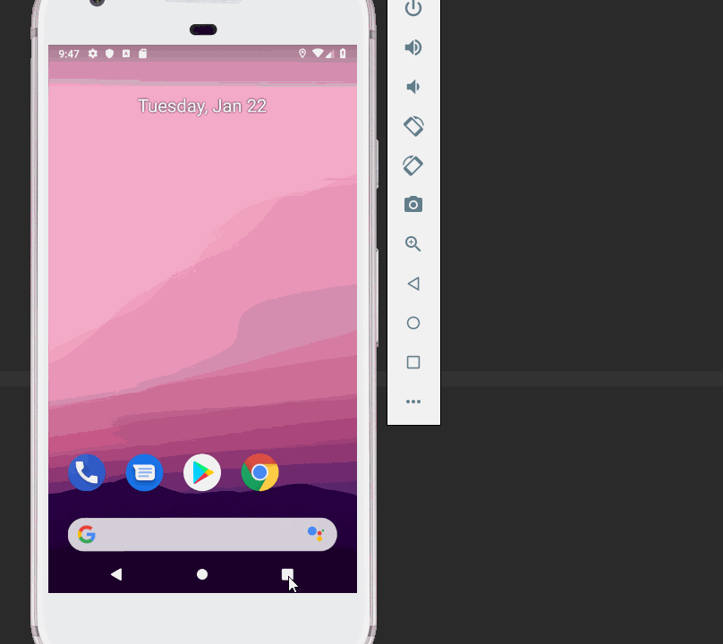

# Flix
Flix is an app that allows users to browse movies from the [The Movie Database API](http://docs.themoviedb.apiary.io/#).

📝 `NOTE -Part 2 pending.:` 
---

## Flix Part 1

### User Stories
#### REQUIRED (10pts)
- [x ] (10pts) User can view a list of movies (title, poster image, and overview) currently playing in theaters from the Movie Database API.

#### BONUS
- [x ] (2pts) Views should be responsive for both landscape/portrait mode.
   - [x ] (1pt) In portrait mode, the poster image, title, and movie overview is shown.
   - [x ] (1pt) In landscape mode, the rotated alternate layout should use the backdrop image instead and show the title and movie overview to the right of it.

- [ ] (2pts) Display a nice default [placeholder graphic](https://guides.codepath.com/android/Displaying-Images-with-the-Glide-Library#advanced-usage) for each image during loading
- [ ] (2pts) Improved the user interface by experimenting with styling and coloring.
- [ ] (2pts) For popular movies (i.e. a movie voted for more than 5 stars), the full backdrop image is displayed. Otherwise, a poster image, the movie title, and overview is listed. Use Heterogenous RecyclerViews and use different ViewHolder layout files for popular movies and less popular ones.

### App Walkthough GIF
 

### Notes
The bigest challenges in this unit was having the recycler view show my data properly. I ended up having to place the title above the picture instead of to the right of the image. This allowed the app to run great and look good in the end but it was a pain to set up. Another issue was implementing the adapter methods. I had to change some of the lables on the created cunstructors to continue. I also had issues getting a Json response and had to remake the app from scratch to find my error, yikes. I plan to keep working on it to make it better before the submission time.

### Open-source libraries used

- [Android Async HTTP](https://github.com/loopj/android-async-http) - Simple asynchronous HTTP requests with JSON parsing
- [Glide](https://github.com/bumptech/glide) - Image loading and caching library for Androids
